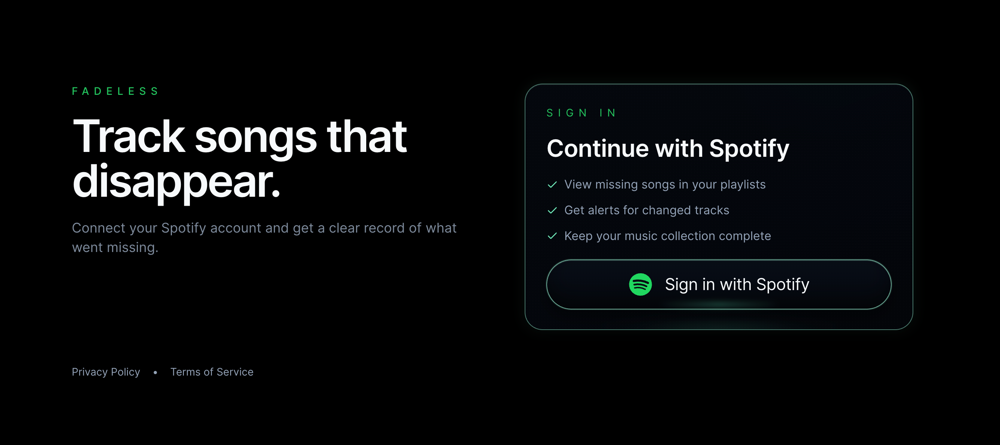
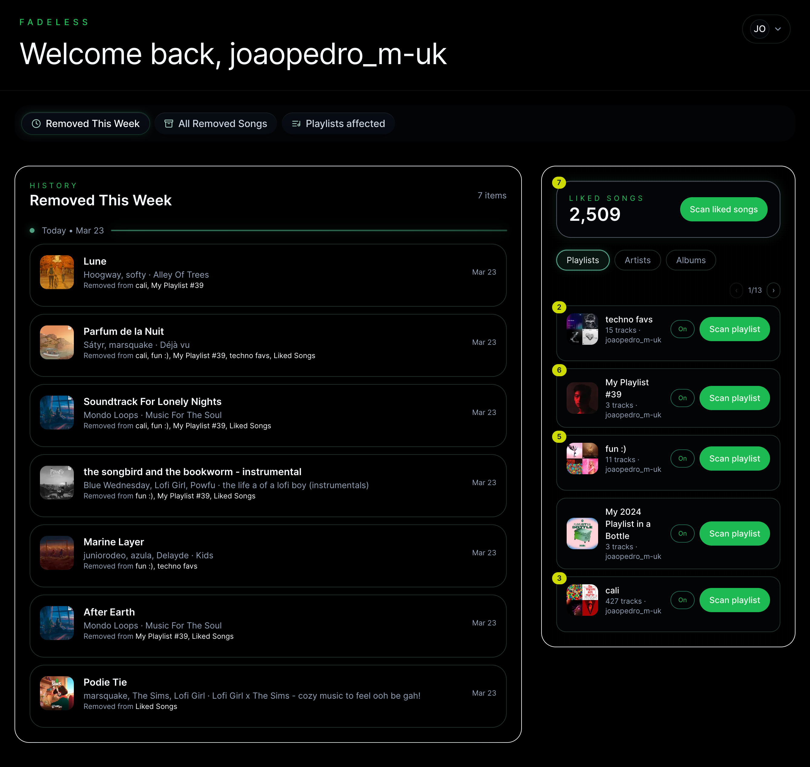
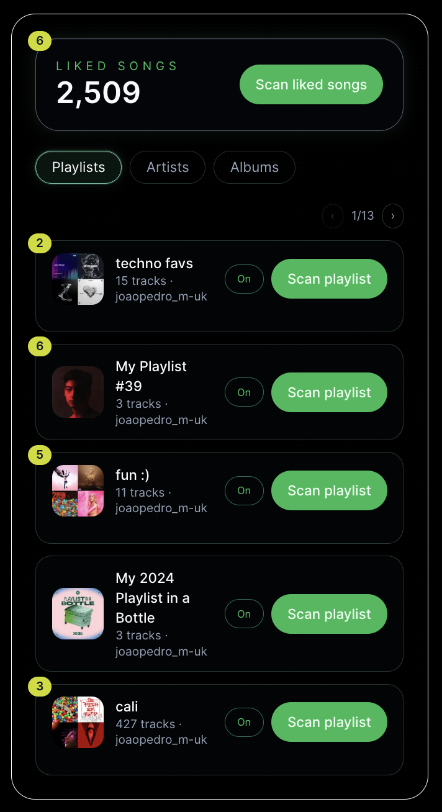
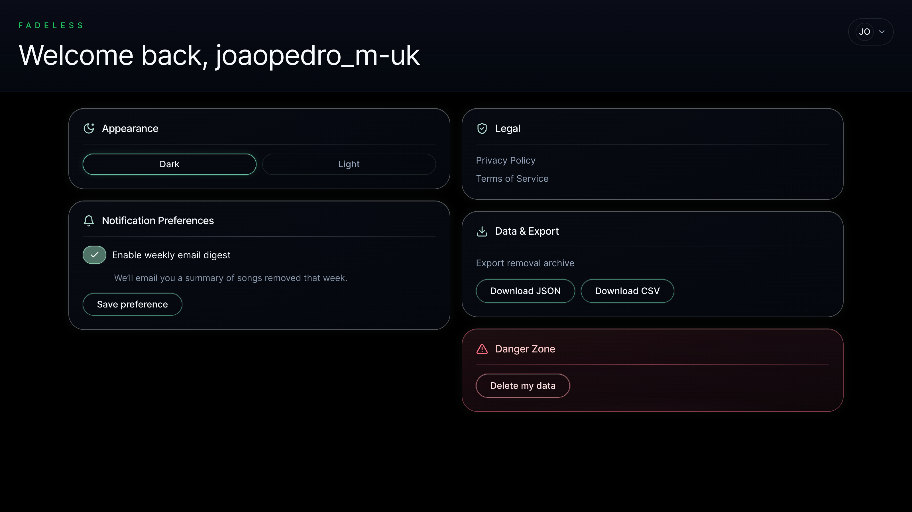
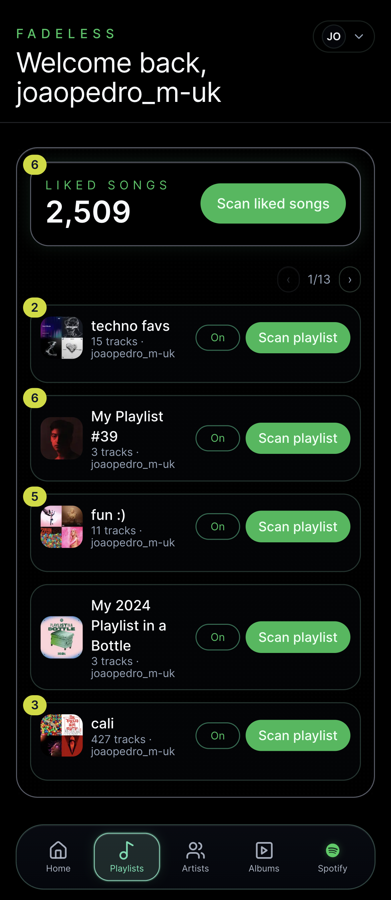

# Fadeless

Track Spotify songs that disappear from your Liked Songs or playlists, preserve the history, and get weekly alerts.

Live app: [https://fadeless.app](https://fadeless.app)

## Product Summary
Spotify can remove tracks silently when rights change or songs are re-uploaded under new IDs. Fadeless gives users visibility into those removals by taking snapshots, diffing them over time, and keeping an archive.

## What Fadeless Does Today
- Authenticates users with Spotify OAuth 2.0 + PKCE (no passwords stored)
- Scans Liked Songs and monitored playlists for removals
- Stores append-only snapshots and removal events in PostgreSQL
- Shows weekly and all-time removal history in the dashboard
- Supports playlist-level monitoring toggles (up to 5 playlists per user)
- Sends weekly digest emails (Resend) or in-app notification badges
- Exports removal history as JSON or CSV
- Supports user data deletion from the settings page

## Screenshots
### Landing And Spotify Sign-In


### Removal Detection Dashboard


### Playlist Monitoring Controls


### Settings, Notifications, Export, And Data Deletion


### Mobile Library With In-App Notification Badges


## Architecture
- Frontend: Next.js App Router + React + TypeScript + Tailwind
- Backend: Route Handlers + Server Actions + modular service layer
- Database: PostgreSQL + Prisma
- Jobs:
  - On-demand scan route: `POST /api/jobs/scan`
  - Netlify background scan worker: `/.netlify/functions/daily-scan`
  - Weekly digest route: `POST /api/jobs/send-weekly-digest`
- Scheduling:
  - `.github/workflows/daily-scan.yml` triggers Netlify scan function every 6 hours
  - `.github/workflows/weekly-digest.yml` triggers weekly digest every Monday

## Tech Stack
- Next.js 16 (App Router)
- React 19
- TypeScript
- Tailwind CSS
- shadcn/ui primitives (Radix)
- Prisma ORM
- PostgreSQL
- Spotify Web API
- Resend (weekly digest email delivery)

## Security And Privacy
- OAuth PKCE for Spotify authorization
- Encrypted access and refresh tokens at rest (AES-256-GCM)
- Signed, server-managed sessions
- Least-privilege Spotify scopes (read-focused)
- Basic API/job rate limiting
- User-scoped data isolation
- One-click history deletion

## Accessibility
- Semantic HTML and accessible component patterns
- Keyboard navigation support
- Visible focus states
- Contrast-aware, Spotify-inspired UI choices

## Current Limitations
- Current release focuses on removal detection by exact Spotify track ID.
- Spotify app allowlist behavior still applies while the Spotify app remains in development mode

## Repository Layout
- `src/app`: routes, API handlers, server actions
- `src/components/auth`: auth and account menu UI
- `src/components/dashboard`: dashboard-level UI sections
- `src/components/library`: library browser panel and subviews
- `src/components/landing`: logged-out landing experience
- `src/components/navigation`: shared navigation components
- `src/components/onboarding`: onboarding dialog flow
- `src/components/scan`: manual scan form/button/status UI
- `src/components/settings`: settings forms and controls
- `src/lib`: business logic (auth, Spotify client/service, jobs, repositories, security, notifications)
- `src/ui`: shared primitive UI components
- `prisma`: schema and migrations
- `netlify/functions`: Netlify scheduled/background scan handlers

## Local Development
### Prerequisites
- Node.js 20+
- PostgreSQL
- Spotify developer app credentials

### Setup
1. Install dependencies:
   ```bash
   npm ci
   ```
2. Create `.env.local` (see env table below).
3. Apply Prisma migrations:
   ```bash
   npx prisma migrate dev
   ```
4. Start the app:
   ```bash
   npm run dev
   ```
5. Open `http://localhost:3000`.

## Environment Variables
Create `.env.local` with:

| Key | Required | Description |
| --- | --- | --- |
| `DATABASE_URL` | Yes | PostgreSQL connection string |
| `DIRECT_URL` | No | Optional direct PostgreSQL URL for Prisma |
| `SPOTIFY_CLIENT_ID` | Yes | Spotify app client id |
| `SPOTIFY_CLIENT_SECRET` | Yes | Spotify app client secret |
| `SPOTIFY_REDIRECT_URI` | Yes | OAuth callback URL (for local: `http://localhost:3000/api/auth/callback`) |
| `SPOTIFY_SCOPES` | No | Optional scope override |
| `ENCRYPTION_SECRET` | Yes | 32+ byte secret for token encryption |
| `SESSION_SECRET` | Yes | 32+ byte secret for session signing |
| `NEXT_PUBLIC_APP_URL` | Yes | Public app URL (`http://localhost:3000` locally) |
| `RESEND_API_KEY` | No | Resend key for weekly email digests |
| `EMAIL_FROM` | No | Verified sender address for digest emails |

## API Endpoints (Key)
- `GET /api/auth/login`
- `GET /api/auth/callback`
- `POST /api/auth/logout`
- `POST /api/jobs/scan`
- `POST /api/jobs/baseline-liked`
- `POST /api/jobs/send-weekly-digest`
- `GET /api/notifications/badges`
- `GET /api/exports/removals?format=json|csv`

## Quality Checks
- Lint: `npm run lint`
- Typecheck: `npm run typecheck`
- Tests: `npm test`

## License
MIT. See [LICENSE](./LICENSE).

## Project Status
Live and actively maintained portfolio project.
